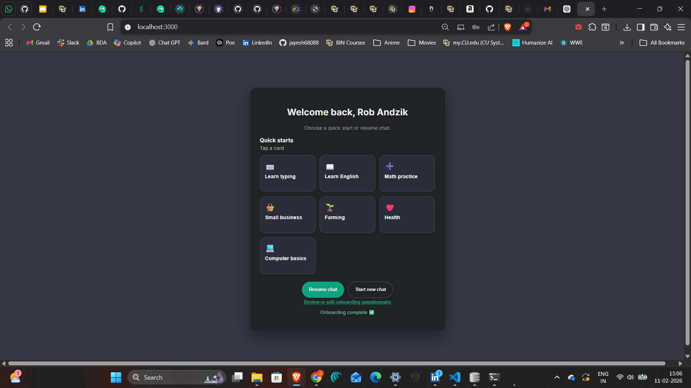

# UI Design - Lalmba (Matoso Chatbot)

This document captures the primary user flow and database proof screens for the UI submission.

## 1) Login
The login page is the entry point for returning users to access their saved sessions.

Given the user is on the login page  
When the user enters a valid username and PIN and clicks Login  
Then the user is authenticated and taken to the Home/Dashboard screen

## 2) Register
The registration page allows a first-time user to create a local account.

Given the user does not have an account  
When the user fills in full name, username, PIN/password, and submits registration  
Then the account is created and onboarding can continue

## 3) Questionnaire
The questionnaire captures profile and learning preferences used for personalization.

Given the user has completed account registration  
When the user fills in onboarding questions and submits  
Then the profile is saved and the user can start using the assistant

## 4) Home/Dashboard
The home/dashboard screen offers quick starts and session controls (Resume Chat / Start New Chat).

Given the user is logged in  
When the home screen is loaded  
Then quick-start options and chat navigation actions are visible

## 5) Chat Session
This screen shows the chat session context and primary interaction area before/while conversation starts.

Given the user opens a chat session  
When the assistant initializes the conversation context  
Then the chat interface is ready for prompts and replies

## 6) Chat Active
The active chat state shows ongoing back-and-forth messages with user and assistant turns.

Given there is an active conversation  
When the user sends a new message  
Then the assistant response is shown in the same session history

## 7) SQLite Users Proof
This screenshot confirms persisted user records in SQLite. The `password_hash` value is hashed/redacted and not stored as plain text.

Given a user has registered  
When user data is written to SQLite  
Then the users table stores identity metadata and hashed credentials

## 8) SQLite Messages Proof
This screenshot confirms message history persistence for chat conversations in SQLite.

Given a conversation has occurred  
When chat messages are saved  
Then the messages table contains user and assistant entries with timestamps
