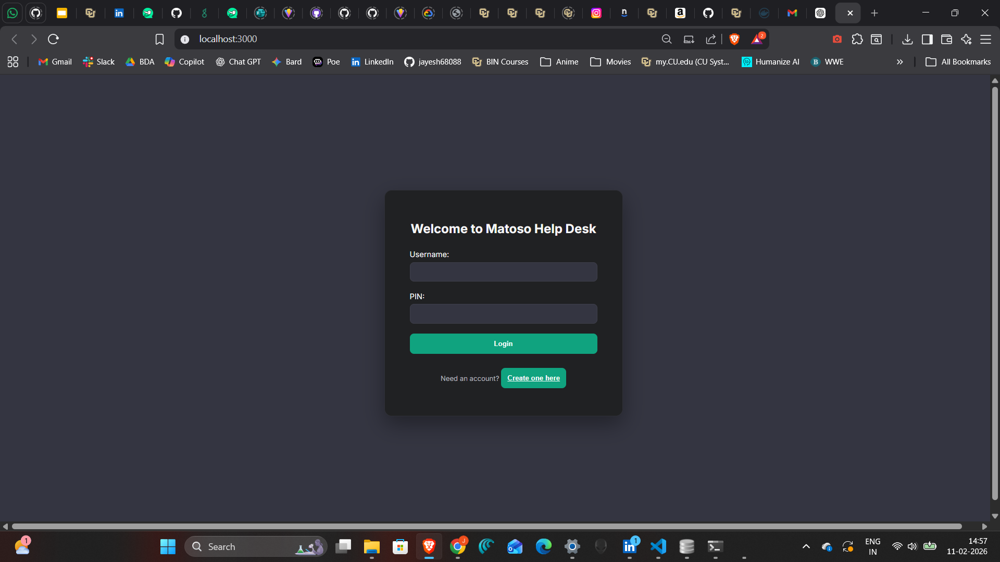
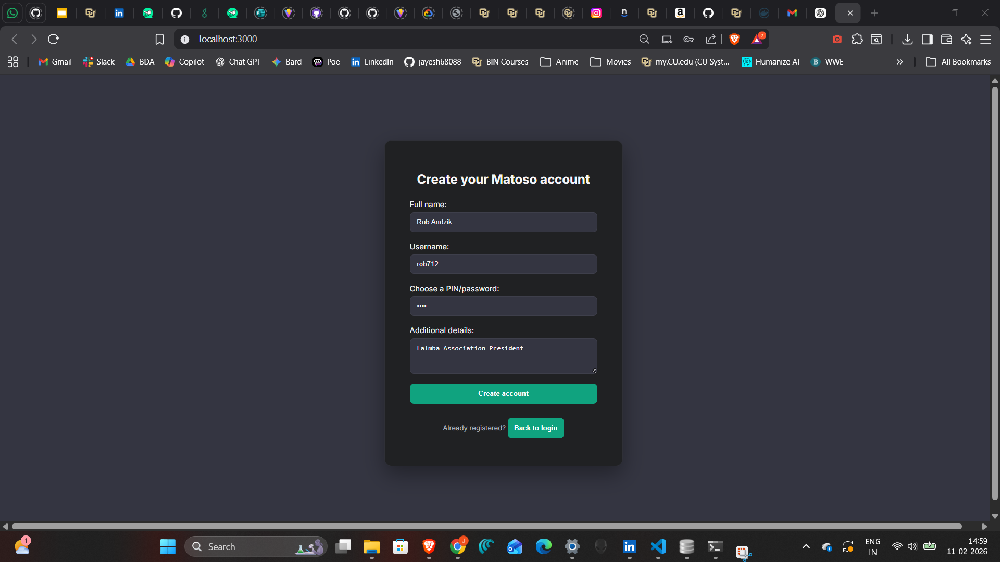
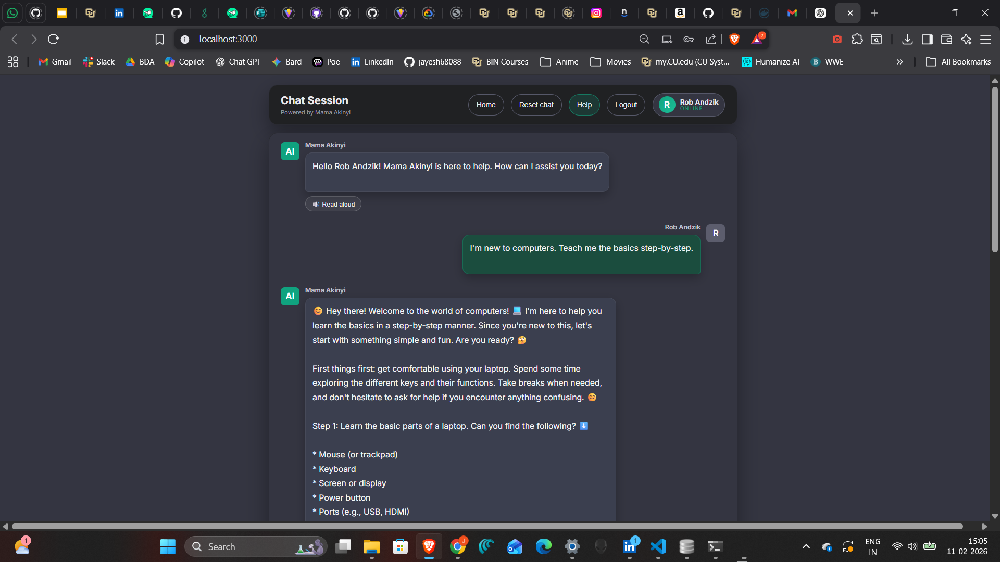
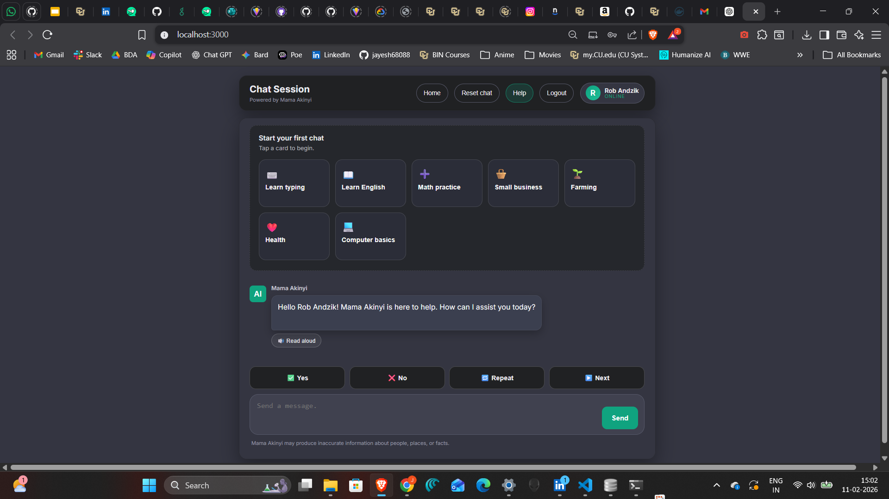
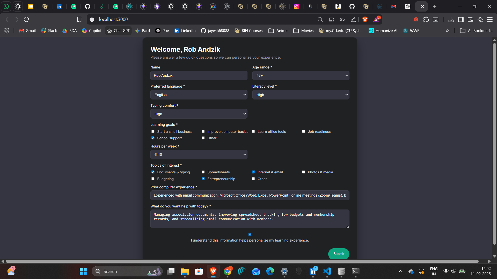
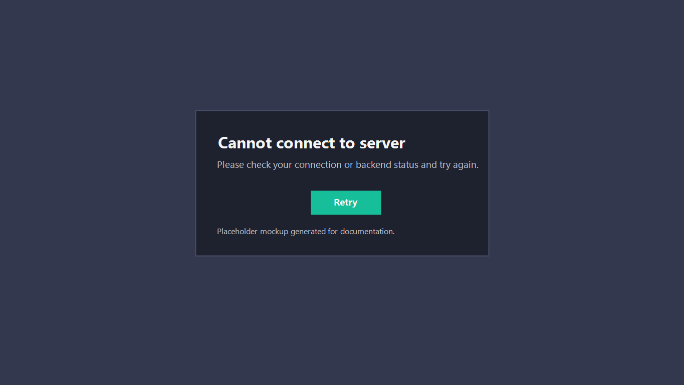
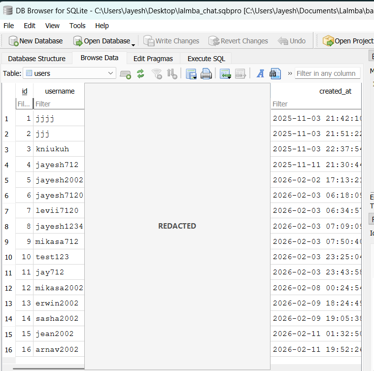
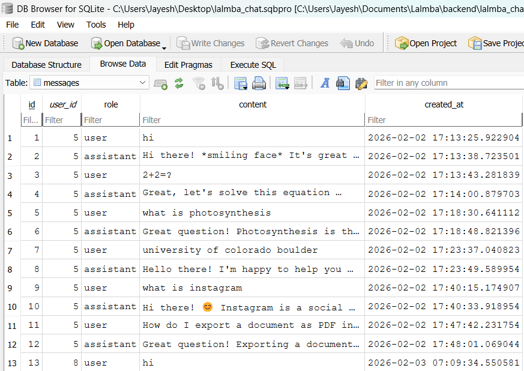

## UI Design - Lalmba (Matoso Chatbot)

### UI Screens (All Pages/States)

#### A) Login

#### B) Register

#### C) Questionnaire

#### D) Home/Dashboard

#### E) Chat Session

#### F) Empty Chat State

#### G) Reset Chat Result

#### H) Error State: Cannot Connect to Server

### Local Storage Proof (SQLite)

### Privacy Notes
- `db-users.png` has the `password_hash` column redacted.
- `db-messages.png` is included as-is after review.
